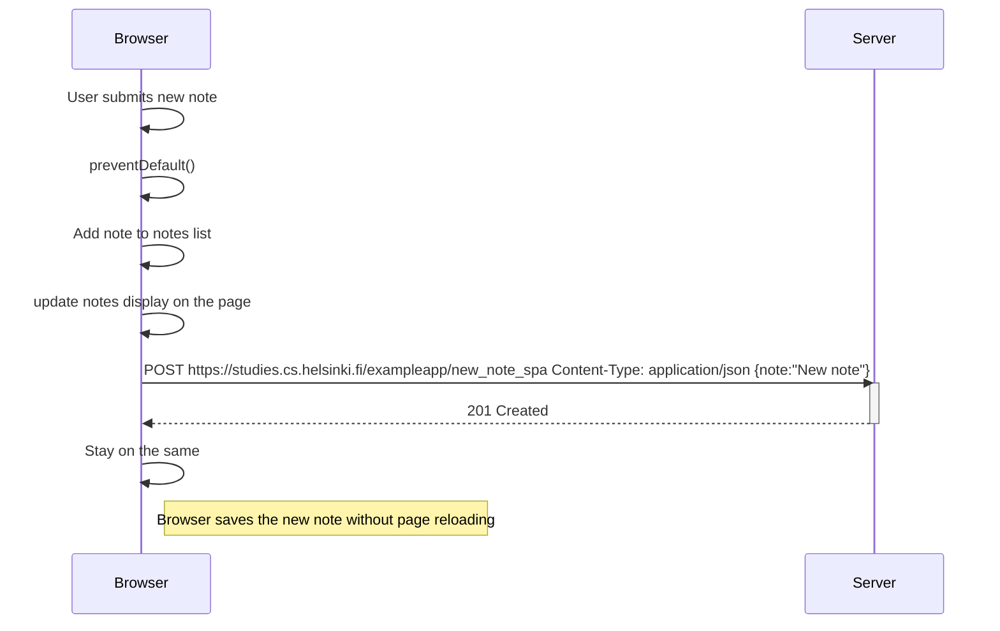

```mermaid
sequenceDiagram
    participant Browser
    participant Server

    Browser->>Browser: User submits new note
    Browser->>Browser: preventDefault()
    Browser->>Browser: Add note to notes list
    Browser->>Browser: update notes display on the page
    Browser->>Server: POST https://studies.cs.helsinki.fi/exampleapp/new_note_spa Content-Type: application/json {note:"New note"}
    activate Server
    Server-->>Browser: 201 Created
    deactivate Server
    Browser->>Browser: Stay on the same
    Note right of Browser: Browser saves the new note without page reloading

```
